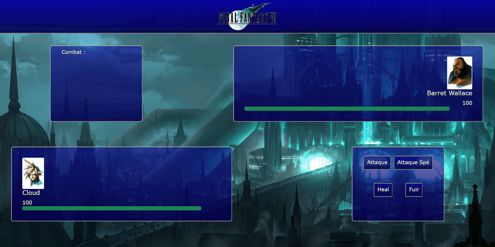

# FFVII-turn-based-game

Hello there,

Here is a turn-based game where I took the design of a fight of **Final Fantasy VII** :blue_heart:.

We find obviously **Cloud** versus **Barret**.

The goal is to fight :boom: **Barret** with a *normal attack* or a *special attack*, that is to say that a *special attack* can be relaunched only after **three turns**.

You can also heal yourself :sparkles:, but when you heal yourself **Barret** attacks you :anger:.

You can also decide to flee and **lose** the fight :feet:.

If you **win** the fight the iconic **Final Fantasy music** will come in your ears :notes:.

Have fun :smile:.

The design of this page is realized with:

* HTML
* CSS
* JavaScript
* VueJS 

Browse the file **app.js** and have fun changing the parameters needed for the fight.

## Requirements

1. No requirements needed, just pull the project.

## Below a gif allowing to realize the design and the functionnality of the fight

